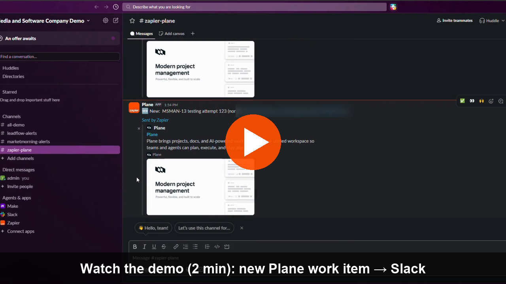
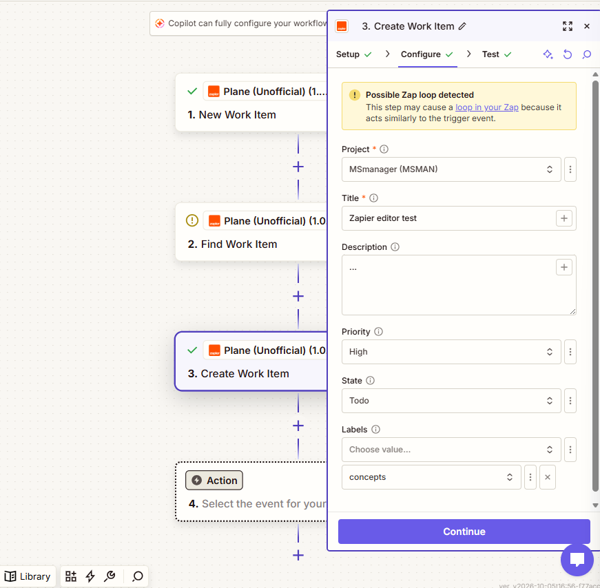
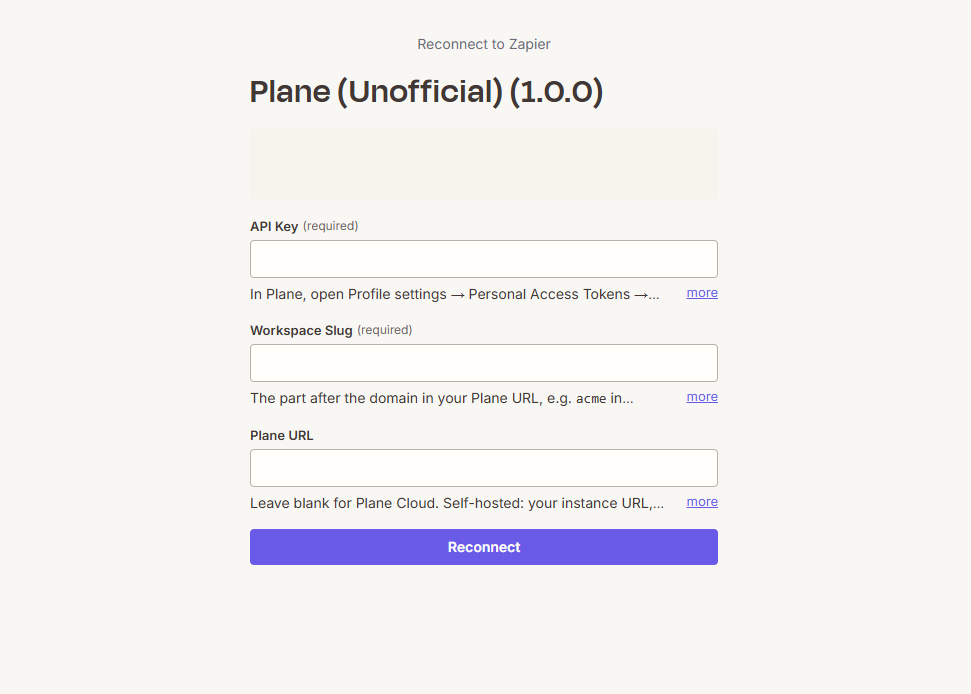
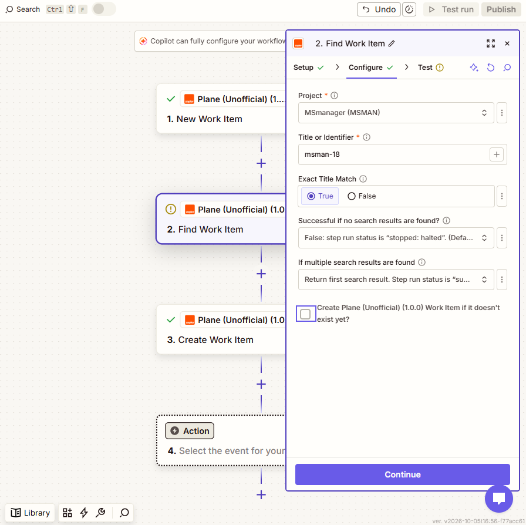
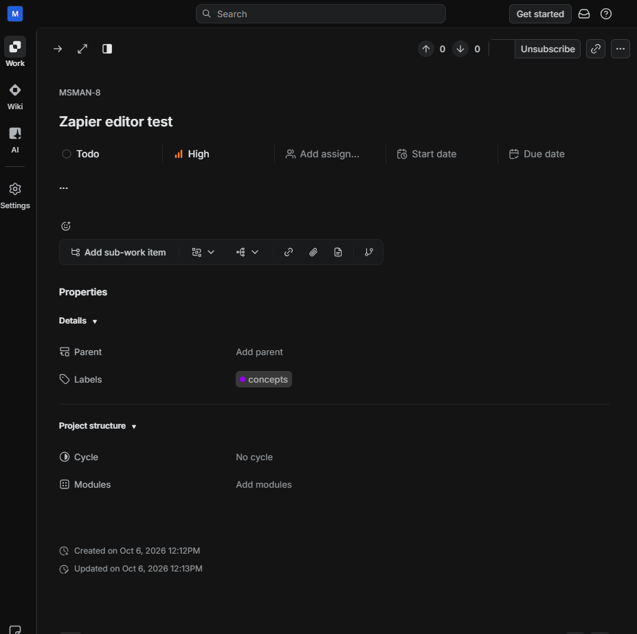

# Plane for Zapier

**Live: https://notm33na.github.io/zapier-plane/** · Zapier version 1.0.0 (invite only)

[](https://github.com/notm33na/zapier-plane/actions/workflows/test.yml)


[](LICENSE)

[](https://zapier.com/developer/public-invite/247303/43b831dc22d46ec496e2a0d5cc7c577d/)

**A Zapier integration for [Plane](https://plane.so), the open-source project management tool.** It connects Plane Cloud or self-hosted Plane to thousands of apps without any code: create work items from forms and emails, find them, and react when new ones appear.

> **Unofficial.** This is a portfolio project. It is not affiliated with, endorsed by, or supported by Plane Software, Inc. "Plane" is their trademark.

[](docs/demo.mp4)



## The problem
Plane has no app in the Zapier directory. Teams on Plane copy form responses, support emails and alerts into Plane by hand, and then announce new work in Slack by hand too.

## What it does
| Type | Name | What it does |
|---|---|---|
| Trigger | **New Work Item** | Starts a Zap when a work item is created in a project you choose. |
| Action | **Create Work Item** | Creates a work item with title, description, priority, state and labels. |
| Search | **Find Work Item** | Finds a work item in a project by exact title or identifier (e.g. `WEB-42`). |
| Search or create | **Find or Create Work Item** | Finds a matching item in the chosen project, or creates it if none exists. |

- **Dropdowns:** project, state and labels. State and labels reload when the project changes.
- **Plain-language errors:** for a bad API key, a wrong workspace, missing access and rate limits.
- **Within Plane's limit:** stays under 60 requests/minute, and every step finishes within Zapier's 30-second limit.
- **Cloud and self-hosted:** works with Plane Cloud and self-hosted Community Edition.

### Example Zaps
- **Typeform response → Create Plane work item.** A bug-report form becomes a work item in *Support*, with the answers in the description.
- **New Plane work item → Slack message.** Every new item in *Website* posts `New: WEB-42 Customer can't reset password (high)` with a link.

## Screenshots
Account names are blanked out.

| Connect an account | Find Work Item (with Find or Create) | The result in Plane |
|---|---|---|
|  |  |  |
| API key and workspace slug, plus an optional URL for self-hosted Plane. | Search by identifier or exact title. Tick the box to create the item when nothing matches. | The item Zapier created, with its priority, state and label. |

## How it's built
- **Stack:** Zapier Platform CLI (`zapier-platform` v19), Node 22, Plane REST API.
- **Key decisions** (each sourced in the [decision log](docs/ARCHITECTURE.md#10-decisions)):
  - Plane's newer API v2 is only on Plane Cloud. The integration uses API v1's `/work-items/` endpoints so self-hosted Community Edition works too.
  - Plane answers a bad API key with **403**, not 401. This was found in Plane's source code and confirmed against the live API, and the integration tells it apart from a real permission error.
  - Find or Create matches only inside the chosen project, and on an exact title by default, so it doesn't create duplicates by mistake.
- **Docs:** [Product spec (PRD)](docs/PRD.md) · [Architecture](docs/ARCHITECTURE.md).

## Testing
| Suite | What it covers | Result |
|---|---|---|
| Unit (`npm test`) | 100 tests with mocked HTTP: auth, error mapping, pagination, trigger, create, search | ✅ runs in CI on every push |
| Live (`npm run test:int`) | 6 end-to-end tests against a real Plane Cloud workspace. They delete everything they create | ✅ passed |
| Manual | Every step tested in the Zapier editor, including the work item link | ✅ passed |

## Project structure
```
index.js              app definition: auth, triggers, creates, searches, Find or Create
authentication.js     API-key auth, connection test and label
lib/                  HTTP client, error mapping, formatting, shared fields
triggers/             New Work Item + dropdown triggers (projects, states, labels)
creates/              Create Work Item
searches/             Find Work Item
test/                 unit tests (nock) and live tests (test/integration)
docs/                 PRD, architecture, screenshots
```

## Run it yourself
Needs Node 22 and the Zapier CLI (`npm i -g zapier-platform-cli`).
```bash
npm install
npm test                           # unit tests, no credentials needed
cp .env.example .env               # add PLANE_API_KEY and PLANE_WORKSPACE_SLUG
npm run test:int                   # live tests against your Plane workspace
zapier-platform login              # then: zapier-platform register, zapier-platform push
```
To connect in Zapier, create a token in Plane under **Profile settings → Personal Access Tokens**, then enter it with your workspace slug (`acme` in `app.plane.so/acme/…`). Self-hosted: also enter your instance URL. It must use HTTPS and be reachable from the internet.

## Status
**v1.0.0 is live** (deployed 2026-10-09) as a private, invite-only Zapier integration. It is not listed in the Zapier directory, but you can try it through the **[invite link](https://zapier.com/developer/public-invite/247303/43b831dc22d46ec496e2a0d5cc7c577d/)**. Accept it in your Zapier account, then search for **Plane (Unofficial)** in the Zap editor. You need your own Plane account (the free plan works). Release notes: [CHANGELOG](CHANGELOG.md) · deployment record: [DEPLOYMENT](docs/DEPLOYMENT.md).

## License
[MIT](LICENSE)
